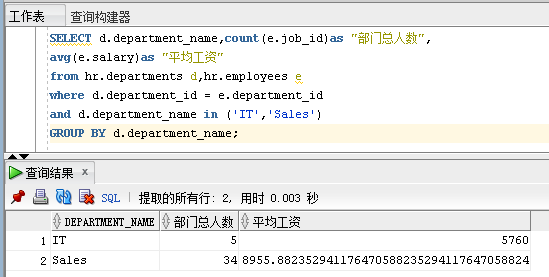
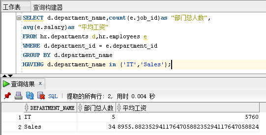
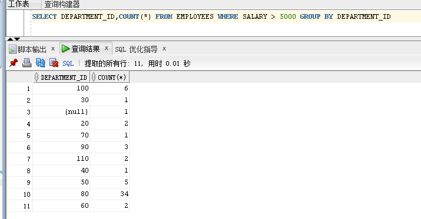
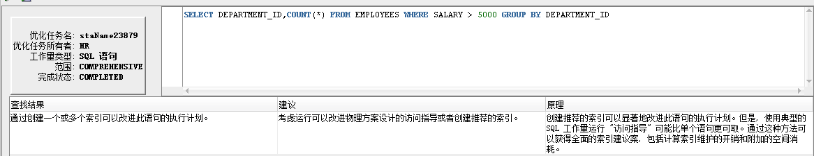

# test1
## 查询1

用时0.003秒
## 查询2

用时0.004秒
---

两种查询语句，查询1的时间更短效率更高，点击sql优化没有给出建议

---

## 自建查询

各个部门中工资大于5000的员工人数

查询语句`SELECT DEPARTMENT_ID,COUNT(*) FROM EMPLOYEES WHERE SALARY > 5000 GROUP BY DEPARTMENT_ID`

查询结果

sql优化建议

