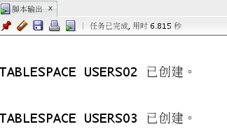
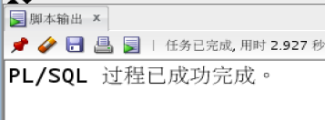
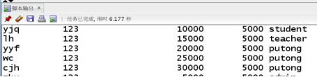
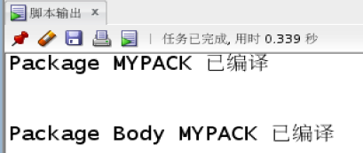
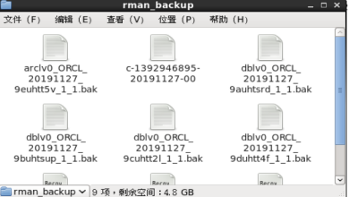

**期末项目设计报告**

| 题 目        | 基于Oracle的外卖系统的数据库设计 |          |              |
|--------------|----------------------------------|----------|--------------|
| 课程         | Oracle数据库应用                 |          |              |
| 学 院        | 信息科学与工程学院               |          |              |
| 专 业        | 软件工程                         | 年级     | 2017级       |
| 学生姓名     | 陈佳豪                           | 学号     | 201710414201 |
| 指导教师     | 赵卫东                           | 职称     | 副教授       |
| **评分项**   | **评分标准**                     | **满分** | **得分**     |
| 文档整体     | 文档内容详实、规范，美观大方     | 10       |              |
| 表设计       | 表，表空间设计合理，数据合理     | 20       |              |
| 用户管理     | 权限及用户分配方案设计正确       | 10       |              |
| PL/SQL设计   | 存储过程和函数设计正确           | 25       |              |
| 备份方案     | 备份方案设计正确                 | 25       |              |
| 容灾方案     | DataGuard设计正确                | 10       |              |
| **得分合计** |                                  |          |              |

2019 年 11 月 18 日

**目录**
========

[一、 目录 2](#目录)

[二、 书店图书销售系统 3](#书店图书销售系统)

[1. 项目背景 3](#项目背景)

[2. 创建数据库 3](#创建数据库)

[3. 创建表空间 3](#创建表空间)

[4. 创建用户与角色，并给用户授权 4](#创建用户与角色并给用户授权)

[5. 系统用表 5](#系统用表)

[6. 数据初始化 13](#数据初始化)

[三、 实验总结 18](#实验总结)

书店图书销售系统
================

项目背景
--------

>   随着信息时代的到来，IT产业和Internet获得了飞速发展，计算机应用已渗透到了各个领域，网络应用越来越普遍，而且走进了千家万户，一直使用手工记账的小镇书店老板，也想购买一个图书销售系统，但想先体验一下计算机的快捷方便。因此，设计了如下测试用例，供其初步体验！

创建数据库
----------

CREATE PLUGGABLE DATABASE cjhpdb admin user cjh IDENTIFIED by 123
file_name_convert=

('/home/oracle/app/oracle/oradata/orcl/pdbseed','/home/oracle/app/oracle/oradata/orcl/cjhpdb');

创建表空间
----------

切换pdb：

alter session set container=cjhpdb;

创建表空间：

CREATE TABLESPACE USERS02

DATAFILE

'/home/oracle/app/oracle/oradata/orcl/cjhpdb/pdbcjh_users02_1.dbf'

size 100M AUTOEXTEND ON NEXT 256M MAXSIZE UNLIMITED,

'/home/oracle/app/oracle/oradata/orcl/cjhpdb/pdbcjh_users02_2.dbf'

SIZE 100M AUTOEXTEND ON next 256M MAXSIZE UNLIMITED

EXTENT MANAGEMENT LOCAL SEGMENT SPACE MANAGEMENT AUTO;

CREATE TABLESPACE USERS03

DATAFILE

'/home/oracle/app/oracle/oradata/orcl/cjhpdb/pdbcjh_users03_1.dbf'

size 100M AUTOEXTEND ON NEXT 256M MAXSIZE UNLIMITED,

'/home/oracle/app/oracle/oradata/orcl/cjhpdb/pdbcjh_users03_2.dbf'

SIZE 100M AUTOEXTEND ON next 256M MAXSIZE UNLIMITED

EXTENT MANAGEMENT LOCAL SEGMENT SPACE MANAGEMENT AUTO;

创建用户与角色，并给用户授权
----------------------------

\-- 创建usercjh用户：

CREATE USER usercjh IDENTIFIED BY 123

DEFAULT TABLESPACE "USERS02"

TEMPORARY TABLESPACE "TEMP";

\-- 给用户usercjh分配表空间：

ALTER USER usercjh QUOTA UNLIMITED ON USERS02;

ALTER USER usercjh QUOTA UNLIMITED ON USERS03;

\-- 创建角色并给用户分配权限：

CREATE ROLE cjhrole1;

GRANT connect,resource,CREATE VIEW TO cjhrole1;

GRANT cjhrole1 to usercjh;

CREATE ROLE cjhrole2;

GRANT dba TO cjhrole2;

GRANT cjhrole2 to usercjh;

系统用表
--------

>   系统用表共四张，分别为：**藏书信息表(book)**、**进货表(stock)**、**出货表(sold)**、**用户表(users)**。

>   **藏书信息表**：用来存放书店现有图书的信息。

>   **进货表**：用来存放书店进货信息。

>   **出货表**：用来存放书店卖出的图书信息。

>   **用户表**：用来存放书店员工信息。

**建表：**

####  藏书信息表(book)

>   藏书信息表(book) 表1

| 列名          | 数据类型 | 长度  | 描述                  |
|---------------|----------|-------|-----------------------|
| bookno        | varchar2 | 6     | 图书编号，定义为主键  |
| bookname      | varchar2 | 20    | 书名， 唯一           |
| species       | varchar2 | 5     | 图书分类， 不允许为空 |
| bookprice     | number   | (7,2) | 图书单价， 不允许为空 |
| publish_house | varchar2 | 20    | 出版社， 不允许为空   |
| publishdate   | date     |       | 出版日期， 不允许为空 |
| author        | varchar2 | 10    | 作者， 不允许为空     |
| number        | number   | 4     | 藏书量， 大于0        |

创建BOOK表：

CREATE TABLE BOOK

(

BOOKNO NUMBER(20, 0) NOT NULL

, BOOKNAME VARCHAR2(20 BYTE)

, SPECIES VARCHAR2(5 BYTE) NOT NULL

, BOOKPRICE NUMBER(7, 2) NOT NULL

, PUBLISH_HOUSE VARCHAR2(20 BYTE)

, PUBLISHDATE DATE

, AUTHOR VARCHAR2(10 BYTE) NOT NULL

, NUMBERS NUMBER

, CONSTRAINT SYS_C0010008 PRIMARY KEY

(

BOOKNO

)

USING INDEX

(

CREATE UNIQUE INDEX SYS_C0010008 ON BOOK (BOOKNO ASC)

LOGGING

TABLESPACE USERS02

PCTFREE 10

INITRANS 2

STORAGE

(

BUFFER_POOL DEFAULT

)

NOPARALLEL

)

ENABLE

)

TABLESPACE USERS02

PCTFREE 10

INITRANS 1

STORAGE

(

BUFFER_POOL DEFAULT

)

NOCOMPRESS

NOPARALLEL

PARTITION BY RANGE (PUBLISHDATE)

(

PARTITION P1 VALUES LESS THAN (TO_DATE(' 2018-01-01 00:00:00', 'SYYYY-MM-DD
HH24:MI:SS', 'NLS_CALENDAR=GREGORIAN'))

LOGGING

TABLESPACE USERS02

PCTFREE 10

INITRANS 1

STORAGE

(

BUFFER_POOL DEFAULT

)

NOCOMPRESS NO INMEMORY

, PARTITION P2 VALUES LESS THAN (TO_DATE(' 2019-01-01 00:00:00', 'SYYYY-MM-DD
HH24:MI:SS', 'NLS_CALENDAR=GREGORIAN'))

LOGGING

TABLESPACE USERS02

PCTFREE 10

INITRANS 1

STORAGE

(

BUFFER_POOL DEFAULT

)

NOCOMPRESS NO INMEMORY

, PARTITION P3 VALUES LESS THAN (TO_DATE(' 2020-01-01 00:00:00', 'SYYYY-MM-DD
HH24:MI:SS', 'NLS_CALENDAR=GREGORIAN'))

LOGGING

TABLESPACE USERS03

PCTFREE 10

INITRANS 1

STORAGE

(

BUFFER_POOL DEFAULT

)

NOCOMPRESS NO INMEMORY

, PARTITION P4 VALUES LESS THAN (MAXVALUE)

LOGGING

TABLESPACE USERS03

PCTFREE 10

INITRANS 1

STORAGE

(

BUFFER_POOL DEFAULT

)

NOCOMPRESS NO INMEMORY

);

ALTER TABLE BOOK

ADD CONSTRAINT SYS_C0010009 UNIQUE

(

BOOKNAME

)

USING INDEX

(

CREATE UNIQUE INDEX SYS_C0010009 ON BOOK (BOOKNAME ASC)

LOGGING

TABLESPACE USERS02

PCTFREE 10

INITRANS 2

STORAGE

(

BUFFER_POOL DEFAULT

)

NOPARALLEL

)

ENABLE;

ALTER TABLE BOOK

ADD CONSTRAINT SYS_C0010007 CHECK

(numbers\>=0)

ENABLE;

#### 5.2、 进货表(stock)

>   进货表(stock) 表2

| 列名     | 数据类型 | 长度 | 描述                 |
|----------|----------|------|----------------------|
| iono     | varchar2 | 6    | 进货编号，定义为主键 |
| bookno   | varchar2 | 6    | 图书编号，定义为外键 |
| numbers  | number   |      | 进货量， 大于等于0   |
| in_price | number   |      | 进价，不能为空       |
| in_time  | date     |      | 进货时间，不能为空   |

>   建表语句：

>   CREATE TABLE STOCK

>   (

>   IONO VARCHAR2(6 BYTE) NOT NULL

>   , BOOKNO NUMBER(20, 0)

>   , NUMBERS NUMBER

>   , IN_PRICE NUMBER NOT NULL

>   , IN_TIME DATE NOT NULL

>   , CONSTRAINT SYS_C0010018 PRIMARY KEY

>   (

>   IONO

>   )

>   USING INDEX

>   (

>   CREATE UNIQUE INDEX SYS_C0010018 ON STOCK (IONO ASC)

>   LOGGING

>   TABLESPACE USERS02

>   PCTFREE 10

>   INITRANS 2

>   STORAGE

>   (

>   BUFFER_POOL DEFAULT

>   )

>   NOPARALLEL

>   )

>   ENABLE

>   )

>   LOGGING

>   TABLESPACE USERS02

>   PCTFREE 10

>   INITRANS 1

>   STORAGE

>   (

>   BUFFER_POOL DEFAULT

>   )

>   NOCOMPRESS

>   NO INMEMORY

>   NOPARALLEL;

>   ALTER TABLE STOCK

>   ADD CONSTRAINT FK_STOCK FOREIGN KEY

>   (

>   BOOKNO

>   )

>   REFERENCES BOOK

>   (

>   BOOKNO

>   )

>   ENABLE;

>   ALTER TABLE STOCK

>   ADD CONSTRAINT SYS_C0010017 CHECK

>   (numbers\>=0)

>   ENABLE;

#### 出货表(sold)

出货表(sold) 表3

| 列名      | 数据类型 | 长度 | 描述                 |
|-----------|----------|------|----------------------|
| oono      | varchar2 | 6    | 出货编号，定义为主键 |
| bookno    | varchar2 | 6    | 图书编号，定义为外键 |
| numbers   | number   |      | 出货量， 大于等于0   |
| out_price | number   |      | 售卖价格，不能为空   |
| out_time  | date     |      | 售卖时间，不能为空   |

>   建表语句：

>   CREATE TABLE SOLD

>   (

>   OONO VARCHAR2(6 BYTE) NOT NULL

>   , BOOKNO NUMBER(20, 0)

>   , NUMBERS NUMBER

>   , OUT_PRICE NUMBER NOT NULL

>   , OUT_TIME DATE NOT NULL

>   , CONSTRAINT SYS_C0010013 PRIMARY KEY

>   (

>   OONO

>   )

>   USING INDEX

>   (

>   CREATE UNIQUE INDEX SYS_C0010013 ON SOLD (OONO ASC)

>   LOGGING

>   TABLESPACE USERS02

>   PCTFREE 10

>   INITRANS 2

>   STORAGE

>   (

>   BUFFER_POOL DEFAULT

>   )

>   NOPARALLEL

>   )

>   ENABLE

>   )

>   LOGGING

>   TABLESPACE USERS02

>   PCTFREE 10

>   INITRANS 1

>   STORAGE

>   (

>   BUFFER_POOL DEFAULT

>   )

>   NOCOMPRESS

>   NO INMEMORY

>   NOPARALLEL;

>   ALTER TABLE SOLD

>   ADD CONSTRAINT FK_SOLD FOREIGN KEY

>   (

>   BOOKNO

>   )

>   REFERENCES BOOK

>   (

>   BOOKNO

>   )

>   ENABLE;

>   ALTER TABLE SOLD

>   ADD CONSTRAINT SYS_C0010012 CHECK

>   (numbers\>=0)

>   ENABLE;

#### 5.4、用户表(users)

>   用户表(users) 表4

| 列名     | 数据类型 | 长度 | 描述               |
|----------|----------|------|--------------------|
| username | varchar2 | 10   | 用户名，定义为主键 |
| password | varchar2 | 15   | 密码， 不允许为空  |
| sal      | number   |      | 月薪，可以为空     |
| comm     | number   |      | 奖金，可以为空     |
| remark   | varchar2 | 15   | 用户类型，允许为空 |

>   建表语句：

>   CREATE TABLE BO_USER

>   (

>   BO_USERNAME VARCHAR2(10 BYTE) PRIMARY KEY

>   , BO_PASSWORD VARCHAR2(15 BYTE) NOT NULL

>   , SAL NUMBER

>   , COMM NUMBER

>   , REMARK VARCHAR2(15 BYTE)

>   )

>   LOGGING

>   TABLESPACE USERS02

>   PCTFREE 10

>   INITRANS 1

>   STORAGE

>   (

>   BUFFER_POOL DEFAULT

>   )

>   NOCOMPRESS

>   NO INMEMORY

>   NOPARALLEL;

#### tablet表;

| T_ID   | NUMBER(10) | 10 | 主键     |
|--------|------------|----|----------|
| T_DATE | DATE       |    | 记录日期 |

建表语句：

CREATE TABLE TABLET

(

T_ID NUMBER(10, 0) PRIMARY KEY

, T_DATE DATE

)

LOGGING

TABLESPACE USERS02

PCTFREE 10

INITRANS 1

STORAGE

(

BUFFER_POOL DEFAULT

)

NOCOMPRESS

NO INMEMORY

NOPARALLEL;

数据初始化
----------

#### 用户表插入数据

插入5万条数据：

declare

u_name VARCHAR2(10);

u_pwd VARCHAR2(15);

u_sal NUMBER;

u_comm NUMBER;

u_re VARCHAR2(15);

begin

/\*

system login:

ALTER USER "TEACHER" QUOTA UNLIMITED ON USERS;

ALTER USER "TEACHER" QUOTA UNLIMITED ON USERS02;

ALTER USER "TEACHER" QUOTA UNLIMITED ON USERS03;

\*/

/\*v_order_detail_id:=1;

delete from order_details;

delete from orders;

\*/

for i in 1..50000

loop

\-- if i mod 6 =0 then

\-- dt:=to_date('2018-01-01','yyyy-mm-dd')+(i mod 60); --PARTITION_2018

\-- elsif i mod 6 =1 then

\-- dt:=to_date('2019-01-01','yyyy-mm-dd')+(i mod 60); --PARTITION_2019

\-- elsif i mod 6 =2 then

\-- dt:=to_date('2020-01-01','yyyy-mm-dd')+(i mod 60); --PARTITION_2020

\-- end if;

/\*V_EMPLOYEE_ID:=CASE I MOD 6 WHEN 0 THEN 11 WHEN 1 THEN 111 WHEN 2 THEN 112

WHEN 3 THEN 12 WHEN 4 THEN 121 ELSE 122 END;

\*/

\--插入订单

u_name:=CASE I MOD 6 WHEN 0 THEN 'zkx' WHEN 1 THEN 'yjq' WHEN 2 THEN 'lh'

WHEN 3 THEN 'yyf' WHEN 4 THEN 'wc' ELSE 'cjh' END;

u_pwd:='123';

u_sal:=CASE I MOD 6 WHEN 0 THEN 5000 WHEN 1 THEN 10000 WHEN 2 THEN 15000

WHEN 3 THEN 20000 WHEN 4 THEN 25000 ELSE 30000 END;

u_comm:=5000;

u_re:=CASE I MOD 6 WHEN 0 THEN 'admin' WHEN 1 THEN 'student' WHEN 2 THEN
'teacher'

ELSE 'putong' END;

insert /\*+append\*/ into BO_USER (BO_USERNAME,BO_PASSWORD,SAL,COMM,REMARK)

values (u_name,u_pwd,u_sal,u_comm,u_re);

\--插入订单y一个订单包括3个产品

\-- v:=dbms_random.value(10000,4000);

\-- v_name:='computer'\|\| (i mod 3 + 1);

\-- insert /\*+append\*/ into
ORDER_DETAILS(ID,ORDER_ID,PRODUCT_NAME,PRODUCT_NUM,PRODUCT_PRICE)

\-- values (v_order_detail_id,v_order_id,v_name,2,v);

\-- v:=dbms_random.value(1000,50);

\-- v_name:='paper'\|\| (i mod 3 + 1);

\-- v_order_detail_id:=v_order_detail_id+1;

\-- insert /\*+append\*/ into
ORDER_DETAILS(ID,ORDER_ID,PRODUCT_NAME,PRODUCT_NUM,PRODUCT_PRICE)

\-- values (v_order_detail_id,v_order_id,v_name,3,v);

\-- v:=dbms_random.value(9000,2000);

\-- v_name:='phone'\|\| (i mod 3 + 1);

\--

\-- v_order_detail_id:=v_order_detail_id+1;

\-- insert /\*+append\*/ into
ORDER_DETAILS(ID,ORDER_ID,PRODUCT_NAME,PRODUCT_NUM,PRODUCT_PRICE)

\-- values (v_order_detail_id,v_order_id,v_name,1,v);

\-- --在触发器关闭的情况下，需要手工计算每个订单的应收金额：

\-- select sum(PRODUCT_NUM\*PRODUCT_PRICE) into m from ORDER_DETAILS where
ORDER_ID=v_order_id;

\-- if m is null then

\-- m:=0;

\-- end if;

\-- UPDATE ORDERS SET TRADE_RECEIVABLE = m - discount WHERE ORDER_ID=v_order_id;

\-- IF I MOD 1000 =0 THEN

\-- commit; --每次提交会加快插入数据的速度

\-- END IF;

end loop;

end;

#### 创建程序包

create or replace PACKAGE MyPack IS

/\*

包MyPack中有：

一个函数:Get_Count，

一个过程:Get_UserType 统计每个用户类型的总数

\*/

FUNCTION Get_Count RETURN NUMBER;

PROCEDURE Get_UserType;

END MyPack;

create or replace PACKAGE BODY MyPack IS

FUNCTION Get_Count RETURN NUMBER

AS

N NUMBER(20,2);

BEGIN

SELECT COUNT(\*) into N FROM BO_USER;

RETURN N;

END;

PROCEDURE Get_UserType

AS

LEFTSPACE VARCHAR(2000);

begin

\--通过LEVEL判断递归的级别

LEFTSPACE:=' ';

\--使用游标

for v in

(SELECT REMARK,SUM(REMARK) U_SUM FROM BO_USER

GROUP BY REMARK)

LOOP

DBMS_OUTPUT.PUT_LINE(LPAD(LEFTSPACE,(1+1),' ')\|\|

V.REMARK\|\|' '\|\|v.U_SUM);

END LOOP;

END;

END MyPack;

测试Get_Count函数：

SELECT MyPack.Get_Count as 总记录数 from dual;

#### 备份

编写脚本文件rman_cjh_level0.sh

\#rman_level0.sh

\#!/bin/sh

export NLS_LANG='SIMPLIFIED CHINESE_CHINA.AL32UTF8'

export ORACLE_HOME=/home/oracle/app/oracle/product/12.1.0/dbhome_1

export ORACLE_SID=orcl

export PATH=\$ORACLE_HOME/bin:\$PATH

rman target / nocatalog msglog=/home/oracle/rman_backup/lv0_\`date
+%Y%m%d-%H%M%S\`_L0.log \<\< EOF

run{

configure retention policy to redundancy 1;

configure controlfile autobackup on;

configure controlfile autobackup format for device type disk to
'/home/oracle/rman_backup/%F';

configure default device type to disk;

crosscheck backup;

crosscheck archivelog all;

allocate channel c1 device type disk;

backup as compressed backupset incremental level 0 database format
'/home/oracle/rman_backup/dblv0_%d_%T_%U.bak'

plus archivelog format '/home/oracle/rman_backup/arclv0_%d_%T_%U.bak';

report obsolete;

delete noprompt obsolete;

delete noprompt expired backup;

delete noprompt expired archivelog all;

release channel c1;

}

EOF

Exit

开始备份：

[oracle\@oracle-pc \~]\$ chmod 755 rman_cjh_level0.sh

[oracle\@oracle-pc \~]\$ ./rman\_

bash: ./rman_: 没有那个文件或目录

[oracle\@oracle-pc \~]\$ ./rman_cjh_level0.sh

RMAN\> 2\> 3\> 4\> 5\> 6\> 7\> 8\> 9\> 10\> 11\> 12\> 13\> 14\> 15\> 16\> RMAN\>
[oracle\@oracle-pc \~]\$

[oracle\@oracle-pc \~]\$

实验总结
========

完成该oracle数据实验基本掌握了数据库的建表操作，并能够创建出符合要求的表，将表与表之间建立联系。并且能够建立出表的视图，方便对图的查看。在进行备份和容灾操作的过程中，能够使用linux命令对数据库进行操作，极大地熟悉了linux的操作，同时也对oracle数据库的操作有了一定的了解。备份与容灾的操作是非常重要的，防止在数据库发生错误的时候，造成数据丢失，在进行这一实验过程的时候，利用了两台虚拟机，分别对主库与备库进行操作，在完成备份之后还进行了模拟删除数据，并成功恢复了数据。

同时在操作的过程中也应该更加认真仔细，在出现问题的时候应该要具备解决问题的能力，例如应该分析错误提示，找到错误的原因，并通过查询资料解决该问题。因为在数据库备份的过程中，等待时间较长，我们也应该耐心等待，不能够进行其他不利于数据库备份的操作。

在这次的实验过后，熟悉了oracle的基本命令，但是在oracle的学习中还远远不够，所以在学习oracle数据库的路程中还任重道远。
